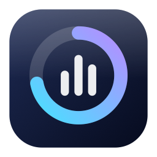
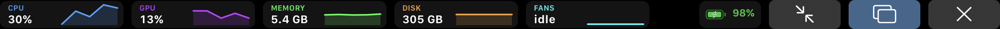

<div align="center">



# GlassDeck

**Your Mac's vitals, in Liquid Glass — on the menu bar and on the Touch Bar.**

[](https://github.com/FraCata00/glassdeck/actions/workflows/ci.yml)
[](https://github.com/FraCata00/glassdeck/releases/latest)
[](https://www.apple.com/macos/)
[](https://swift.org)
[](LICENSE)

</div>

GlassDeck is a menu bar system monitor for macOS. It reads CPU, GPU, memory, disk,
network, fan speed and battery straight from the kernel, renders them in the
macOS 26 Liquid Glass material, and — on a MacBook Pro that has one — puts them
on the Touch Bar where they are actually glanceable.

No Dock icon. No network access. No root. No helper daemon.

---

## The Touch Bar, properly

**Full width** — every metric, fan RPM, battery, and controls to shrink, open the
dashboard or collapse back:



**Sharing the bar** — a compact set that leaves the system Control Strip alone:


Three states, one tap apart:

| State | What you get | How to get there |
| --- | --- | --- |
| **Control Strip** | A compact meter chip inside the Control Strip | Default; tap the chip to expand |
| **Expanded** | Four live graphs, battery, controls — Control Strip stays visible | Tap the chip, or set *Take over the whole Touch Bar* |
| **Full width** | Everything, plus **fan RPM**, across the entire bar | Tap ⤢ on the expanded bar |

Collapsing hands the Touch Bar straight back to the system and the frontmost app.

## Features

- **CPU** — total, user/system split, per-core bars grouped into Apple silicon's
  performance and efficiency clusters, plus load average.
- **GPU** — device, renderer and tiler utilisation with allocated video memory,
  read from the IOKit accelerator registry.
- **Memory** — used (active + wired + compressed), the same arithmetic Activity
  Monitor uses, plus swap.
- **Disk** — capacity of the boot volume and live read/write throughput.
- **Network** — aggregate up/down throughput across active interfaces.
- **Fans** — live RPM and each fan's rated range, read from the SMC.
- **Battery** — charge, charging state and time to full/empty.
- **Top processes** — the busiest processes, sampled only while a window is open.
- **Liquid Glass everywhere** — real `glassEffect` surfaces on macOS 26+, with a
  vibrant-material fallback on macOS 15.

## Requirements

- macOS 15 or later (Liquid Glass surfaces need macOS 26+; older systems get the
  material fallback)
- Apple silicon or Intel
- A Touch Bar for the Touch Bar features — everything else works without one

## Install

### From a release

1. Download `GlassDeck.zip` from the [latest release](https://github.com/FraCata00/glassdeck/releases/latest).
2. Move `GlassDeck.app` to `/Applications`.
3. The build is signed ad hoc, not notarised, so Gatekeeper needs one nudge:

   ```sh
   xattr -dr com.apple.quarantine /Applications/GlassDeck.app
   ```

### From source

```sh
git clone https://github.com/FraCata00/glassdeck.git
cd glassdeck
Scripts/bundle.sh --universal          # builds .build/bundle/GlassDeck.app
open .build/bundle/GlassDeck.app
```

## Usage

- The status item shows a live bar per metric; click it for the glass panel.
- **Dashboard** opens the full window: hero gauge, per-core grid, metric cards,
  top processes.
- **Settings** covers the sampling interval, which metrics appear where, the
  Touch Bar placement, and opening at login.

## How it works

Everything is read directly from public kernel interfaces — no shelling out to
`ps`, `powermetrics` or `ioreg`, and nothing that needs privileges.

| Metric | Source |
| --- | --- |
| CPU | `host_processor_info(PROCESSOR_CPU_LOAD_INFO)` tick deltas, `hw.perflevel*.logicalcpu`, `getloadavg` |
| GPU | `IOAccelerator` → `PerformanceStatistics` |
| Memory | `host_statistics64(HOST_VM_INFO64)`, `vm.swapusage` |
| Disk | `URLResourceValues` + `IOBlockStorageDriver` → `Statistics` |
| Network | `getifaddrs` → `if_data` counters |
| Fans | `AppleSMC` user client (`FNum`, `F<n>Ac/Mn/Mx`), read-only |
| Battery | `IOPSCopyPowerSourcesInfo` |
| Processes | `libproc` (`proc_listpids`, `proc_pidinfo`) |

The Control Strip item uses two private DFRFoundation entry points
(`DFRElementSetControlStripPresenceForIdentifier`,
`DFRSystemModalShowsCloseBoxWhenFrontMost`) and the private
`NSTouchBarItem.addSystemTrayItem` / `NSTouchBar.presentSystemModalTouchBar`
selectors — the same route every Touch Bar utility takes, since Apple never
shipped a public one. All of them are resolved at runtime through `dlsym` and the
Objective-C runtime: on a Mac without a Touch Bar, or a macOS that drops them,
they degrade to no-ops instead of breaking the app.

**GlassDeck never writes to the SMC.** Fan control is out of scope by design.

## Architecture

```
Sources/
├── GlassDeckKit/          # No UI. Samplers, models, the sampling actor.
│   ├── Model/             # MetricsSnapshot, MetricKind, per-metric value types
│   ├── Samplers/          # One file per data source (CPU, GPU, memory, disk, …)
│   ├── MetricsEngine.swift  # actor: serialises every sampler
│   └── SystemMonitor.swift  # @MainActor @Observable façade + rolling history
└── GlassDeck/             # The app.
    ├── UI/                # SwiftUI: glass surfaces, gauges, cards, dashboard
    ├── TouchBar/          # AppKit: Control Strip item, expanded bars, DFR bridge
    └── System/            # Preferences, login item, window ownership
```

Samplers hold mutable tick baselines and are confined to `MetricsEngine`; the
snapshots they produce are immutable value types, so the whole pipeline is
`Sendable` under Swift 6 strict concurrency.

## Development

```sh
swift build                 # build
swift test                  # 22 tests, including live sampling assertions
Scripts/bundle.sh --debug   # assemble a runnable .app
Scripts/make-icon.swift .   # regenerate the icon artwork from code
```

Two environment variables help with manual testing, since neither the Touch Bar
nor a menu bar extra can be driven by scripted clicks:

```sh
GLASSDECK_TOUCHBAR_MODE=fullscreen|expanded    # come up with the bar presented
GLASSDECK_OPEN_DASHBOARD=1                     # come up with the dashboard open
```

## Contributing

Commits follow [Conventional Commits](https://www.conventionalcommits.org/) and
are checked in CI. See [CONTRIBUTING.md](CONTRIBUTING.md).

## License

[MIT](LICENSE) © Francesco Cataldo
